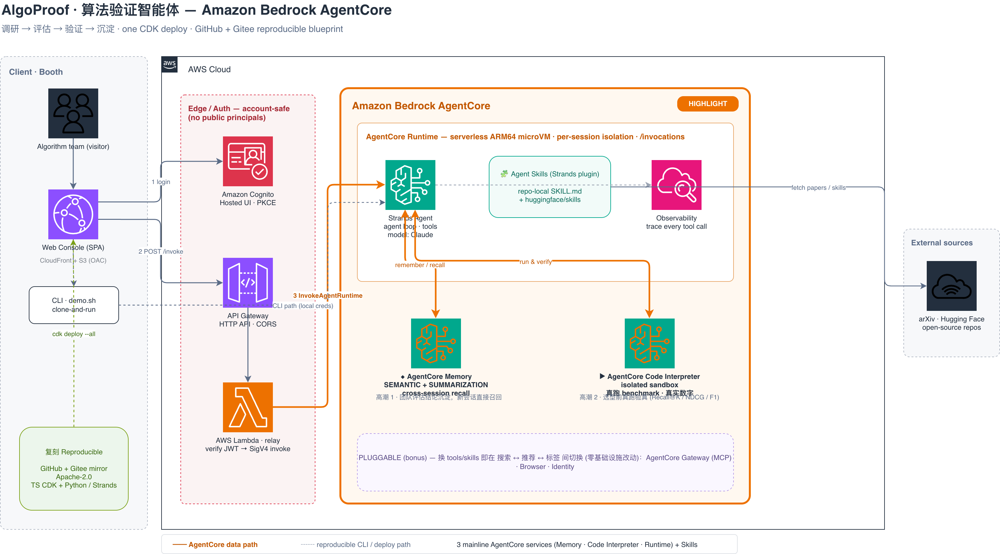

<div align="center">

# AlgoOps · 算法效能智能体

**让 Agent 以「AI 验证 AI」替团队做内部业务的模型选型**

[](./LICENSE)
[](https://aws.amazon.com/bedrock/agentcore/)
[](https://strandsagents.com/)
[](https://docs.aws.amazon.com/cdk/)
[](#-验证--testing)

</div>

---

以企业 **搜索 / 推荐 / 标签** 系统为例,Agent 按「**调研 → 评估 → 验证 → 沉淀**」协同:
读源材料产出**评估卡**,在 **AgentCore Code Interpreter** 沙箱里**真跑 benchmark**
(`Recall@K` / `NDCG@K` / `F1`)验证宣称指标,根治"**离线漂亮、上线翻车**";历次选型
结论由 **AgentCore Memory**(SEMANTIC + SUMMARIZATION)跨会话记忆召回,不重复踩坑;
评估方法论沉淀为可复用 **Skills**。一条 `cdk deploy` 起全栈。

> A real, CDK-deployable demo on **Amazon Bedrock AgentCore** built with the
> **Strands Agents SDK** — *let AI verify AI* for internal model selection.

<div align="center">
  
</div>

## ✨ 四阶段 · The four stages

| 阶段 | 它做什么 | AgentCore 能力 | 根治的痛点 |
|---|---|---|---|
| **调研 Survey** | 取候选模型的宣称指标 / 数据集 / 适用场景 | Runtime | — |
| **评估 Assess** | 产出结构化**评估卡**,标出风险与待验证项 | Strands **Skills**(`model-eval-card`) | 🎲 评估没有可复用方法论 |
| **验证 Verify** | 沙箱**真跑** `Recall@K`/`NDCG@K`/`F1`,对比宣称 vs 实测 | **Code Interpreter** | 🤡 "离线漂亮、上线翻车" |
| **沉淀 Persist** | 历次选型结论跨会话召回,不重复踩坑 | **Memory**(SEMANTIC+SUMMARIZATION) | 🔁 重复踩同一个坑 |

## 🏗 架构 · Architecture

浏览器**不能直连** AgentCore(端点无 CORS、仅流式),账户也禁止公开 Lambda URL,
所以前门是 **API Gateway**,认证(Cognito JWT)在中转 Lambda 内完成 —— 全程无公开策略。

```
浏览器 (CloudFront 静态站, Cognito Hosted UI 登录拿 JWT)
   │  POST /invoke  (Authorization: Bearer <JWT>)
   ▼
API Gateway HTTP API ──▶ relay Lambda  (校验 Cognito JWT, 再 invoke_agent_runtime)
                              │
                              ▼
                     AgentCore Runtime  (Strands Agent)
                      ├─ Memory          跨会话选型结论召回
                      ├─ Code Interpreter 沙箱真跑 benchmark
                      └─ Skills          评估方法论(repo-local + huggingface/skills)
```

一个 TypeScript CDK app 起全栈:**AgentStack**(Runtime + Memory + Code Interpreter)
+ **WebAppStack**(CloudFront + Cognito + API Gateway + relay Lambda)。

## 📁 仓库结构 · Layout

```
algoops-demo/
├── source/
│   ├── agent/            # Python · Strands Agent
│   │   └── agent/        #   loader / main / tools(candidate·benchmark·reproduce)/ skills / prompts
│   ├── infrastructure/   # TypeScript CDK(agent-stack · webapp-stack · relay lambda)
│   └── web/              # 前端控制台(登录门 + 三块实时仪表盘)
├── scripts/              # demo.sh · seed.sh · smoke.sh(CLI 旁路, 复刻演示)
└── docs/                 # 架构图 · Summit 提名材料
```

## 🚀 快速开始 · Quick start

**前置:** AWS 账户(AgentCore 可用区)· 已开通 Bedrock Claude 模型 · Node 20+ · AWS CDK v2 · Docker(构建 ARM64 镜像)· Python 3.12 + [uv](https://docs.astral.sh/uv/)

```bash
git clone https://github.com/IanLiYi1996/algoops-demo
cd algoops-demo/source/infrastructure
npm install
npx cdk deploy --all          # 构建 ARM64 镜像 → ECR;一次起全栈
# 输出:ResearchCopilotWebApp.WebUrl, ResearchCopilotAgent.RuntimeArn
```

打开 `WebUrl` → Cognito 登录 → 在控制台下指令,看三块仪表盘(评估卡 / Memory 召回 / Sandbox 真跑)实时点亮。

**CLI 旁路(复刻演示用):**

```bash
export RUNTIME_ARN=<RuntimeArn 输出>
./scripts/seed.sh             # 预热 Memory:先评估几个候选模型
./scripts/demo.sh "Evaluate candidate model bge-m3: produce its evaluation card and store the conclusion." booth-1
./scripts/smoke.sh            # 三步冒烟:评估 → 跨会话召回 → 沙箱真跑验证
```

**拆除(控成本):**

```bash
cd source/infrastructure && npx cdk destroy --all
```

## ✅ 验证 · Testing

```bash
cd source/agent          && uv run pytest -q     # 18 passed
cd source/infrastructure && npm test             # 6 passed
cd source/infrastructure && npx cdk synth         # synth OK
```

Agent 工具(`candidate`/`benchmark`/`reproduce`)是纯函数,离线可测;CDK 用 Jest 快照测试。

## 🔁 可泛化 · Generalization

只换 `source/agent/agent/{tools, skills, prompts}` 和种子数据,**同一套 Runtime + Memory +
Code Interpreter + Skills 骨架**就能从"搜/推/标签模型选型"切到 金融 / 生物 / 运维 等任意
内部业务领域 —— 基础设施一行不改。这正是本 demo 想证明的:**harness 的能力来自骨架,
领域只是插件**。

## 📜 License

MIT — 见 [LICENSE](./LICENSE)。
